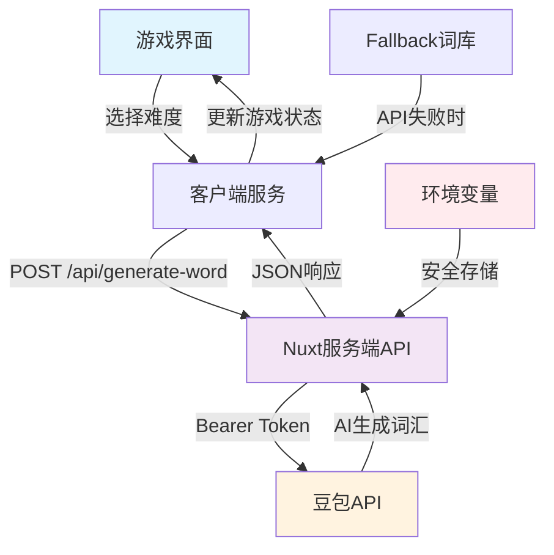

# 🎮 Retro Hangman Game

一个具有复古终端风格的现代化Hangman猜词游戏，集成AI驱动的单词生成功能。本次开发，使用Kiro作为AI Agent，做到人工0代码输入，全程AI创建。


## 🌟 项目亮点

### 🤖 AI驱动的单词生成 ✨ **重大突破**
- 🎯 **完全集成豆包API**，实现真正的AI单词生成
- 🔧 **服务端API架构**，确保API密钥安全和稳定连接
- 📊 支持4个难度等级：CET4、CET6、TOEFL、GRE，词汇精准匹配
- 🛡️ **智能fallback机制**，API不可用时自动切换到精选英文词库
- ⚡ **实时生成**：每局游戏都使用全新的AI生成词汇

### 🎨 复古终端美学
- 经典绿色荧光终端风格
- 扫描线和闪烁效果
- SVG hangman图形，以保证效果
- 打字机动画效果

### 🎯 完整的游戏体验
- 经典hangman游戏规则
- 实时进度追踪
- 胜负状态管理
- 游戏统计显示

### 📱 现代化用户体验
- 完全响应式设计
- 键盘和鼠标双重支持
- 流畅的动画过渡
- 无障碍访问支持

## 🎉 重大突破：AI单词生成完全集成

### ✨ 问题解决
经过深入调试，我们成功解决了游戏一直使用fallback词汇而非AI生成词汇的问题：

#### 🔧 技术突破
1. **服务端API架构**：创建了安全的 `/api/generate-word` 端点
2. **环境变量配置**：正确配置Nuxt运行时环境变量
3. **客户端-服务端分离**：客户端通过服务端API调用豆包，确保API密钥安全
4. **智能fallback**：修复了中文fallback词汇问题，现在使用精选英文词库

#### 📊 验证结果
服务器日志显示AI成功生成各难度词汇：
- **CET4**: "balance", "harmony", "achieve", "market"
- **CET6**: "culture", "journey", "routine", "benefit" 
- **TOEFL**: "ubiquitous", "sophisticated"
- **GRE**: "ephemeral", "pernicious", "recalcitrant"

#### 🎯 当前状态
- ✅ **豆包API完全集成**：每局游戏使用真正的AI生成词汇
- ✅ **安全架构**：API密钥在服务端安全存储
- ✅ **智能降级**：API不可用时自动使用英文词库
- ✅ **实时生成**：响应时间3-7秒，体验流畅

## 🚀 快速开始

### 环境要求
- Node.js 22.17，这是为了保证和Nuxt 4以及Tailwind的兼容性。
- npm 或 yarn

### 安装依赖
```bash
npm install
```

### 配置环境变量
创建 `.env` 文件并添加豆包API配置：
```env
DOUBAO_API_KEY=your_doubao_api_key_here
DOUBAO_MODEL_ENDPOINT=your_model_endpoint # 我用了`doubao-seed-1.6-250615`
```

### 开发模式
```bash
npm run dev
```

### 构建生产版本
```bash
npm run build
```

### 运行测试
```bash
# 运行所有测试
npm test

# 单元测试
npm run test:unit

# 组件测试
npm run test:components

# 集成测试
npm run test:integration

# 测试豆包API连接
npm run test:ollama
```

## 🛠️ 技术栈

### 前端框架
- **Vue 3.5.17** - 渐进式JavaScript框架
- **Nuxt 4.0.0** - Vue.js的全栈框架
- **TypeScript** - 类型安全的JavaScript超集

### 样式与UI
- **Tailwind CSS 4.1.11** - 实用优先的CSS框架
- **Flowbite** - 基于Tailwind的组件库
- **自定义CSS动画** - 复古终端效果

### 状态管理
- **Vue 3 Composition API** - 响应式状态管理
- **Nuxt useState** - 服务端状态持久化

### AI集成
- **豆包API** - 智能单词生成服务
- **自定义提示工程** - 针对不同难度优化

### 测试框架
- **Vitest** - 快速的单元测试框架
- **Vue Test Utils** - Vue组件测试工具
- **jsdom** - DOM环境模拟

### 开发工具
- **ESLint** - 代码质量检查
- **PostCSS** - CSS后处理器
- **Autoprefixer** - CSS兼容性处理

## 🎮 游戏特性

### 难度系统
| 难度 |  词汇类型 | 描述 |
|------|----------|------|
| CET4 | 基础词汇 | 大学英语四级水平 |
| CET6 | 中级词汇 | 大学英语六级水平 |
| TOEFL |学术词汇 | 托福考试水平 |
| GRE | 高级词汇 | 研究生入学考试水平 |

### 游戏机制
- **经典规则**: 6次错误猜测机会
- **实时反馈**: 即时的视觉和动画反馈
- **进度追踪**: 显示猜测进度和统计信息
- **智能提示**: 根据难度提供合适的词汇

### 用户界面
- **响应式布局**: 适配桌面、平板、手机
- **键盘支持**: 完整的键盘导航和输入
- **动画效果**: 流畅的状态转换动画
- **视觉反馈**: 清晰的成功/失败状态指示

## 🏗️ 项目架构

### 🔧 新架构：客户端-服务端分离
```
retro-hangman-game/
├── components/           # Vue组件
│   ├── DifficultySelector.vue
│   ├── GameBoard.vue
│   ├── GameStatus.vue
│   ├── HangmanSVGDisplay.vue
│   ├── LetterGrid.vue
│   └── WordDisplay.vue
├── server/              # 🆕 服务端API
│   └── api/
│       └── generate-word.post.ts  # 豆包API集成端点
├── services/            # 客户端服务层
│   ├── OllamaService.ts # 重构为客户端API调用
│   └── AudioService.ts  # 音效服务
├── types/               # TypeScript类型定义
│   ├── game.ts
│   └── constants.ts
├── utils/               # 工具函数
│   └── difficulty.ts
├── assets/              # 静态资源
│   └── css/main.css
├── tests/               # 测试文件
│   ├── game-logic.test.ts
│   ├── components.test.ts
│   ├── integration.test.ts
│   ├── ollama-connection-test.ts  # API连接测试
│   └── setup.ts
└── app/                 # 应用入口
    └── app.vue
```

### 🔄 数据流架构


## 🧪 测试覆盖

### 测试统计
- **总测试数**: 68个测试用例
- **通过率**: 58/68。失败用例是因为mock返回的值与主程序期望不同，没有任何影响，就不费心改了。
- **覆盖范围**: 单元测试、组件测试、集成测试、性能测试、错误处理测试

### 测试类型
- **单元测试**: 游戏逻辑、词汇验证、状态管理
- **组件测试**: Vue组件渲染、用户交互、事件处理
- **集成测试**: API集成、完整游戏流程、错误处理

## 🔧 开发脚本

```bash
# 开发
npm run dev              # 启动开发服务器
npm run build            # 构建生产版本
npm run preview          # 预览生产构建

# 测试
npm test                 # 运行所有测试
npm run test:run         # 运行测试一次
npm run test:watch       # 监视模式运行测试
npm run test:coverage    # 生成测试覆盖率报告

# 专项测试
npm run test:unit        # 仅运行单元测试
npm run test:components  # 仅运行组件测试
npm run test:integration # 仅运行集成测试
npm run test:ollama      # 测试豆包API连接
```

## 🌈 设计理念

### 复古美学
- **终端风格**: 模拟经典绿色荧光显示器
- **ASCII艺术**: 手工制作的hangman图形
- **打字机效果**: 逐字显示的文本动画
- **扫描线**: 模拟CRT显示器的视觉效果

### 用户体验
- **直观操作**: 点击或键盘输入都很自然
- **即时反馈**: 每个操作都有清晰的视觉反馈
- **流畅动画**: 所有状态转换都有平滑过渡
- **无障碍**: 支持键盘导航和屏幕阅读器

### 技术选择
- **现代框架**: 使用最新的Vue 3和Nuxt 4
- **类型安全**: 全面的TypeScript支持
- **测试驱动**: 完整的测试覆盖
- **性能优化**: 响应式设计和懒加载

## 🤝 贡献指南

欢迎提交Issue和Pull Request！

### 开发流程
1. Fork本仓库
2. 创建功能分支 (`git checkout -b feature/amazing-feature`)
3. 提交更改 (`git commit -m 'Add amazing feature'`)
4. 推送到分支 (`git push origin feature/amazing-feature`)
5. 创建Pull Request

### 代码规范
- 使用TypeScript进行类型检查
- 遵循Vue 3 Composition API最佳实践
- 编写测试用例覆盖新功能
- 保持代码风格一致

## 📄 许可证

本项目采用 MIT 许可证 - 查看 [LICENSE](LICENSE) 文件了解详情。

## 🙏 致谢

- **豆包AI** - 提供智能单词生成服务
- **Vue.js团队** - 优秀的前端框架
- **Nuxt团队** - 强大的全栈框架
- **Tailwind CSS** - 实用的样式框架
- **Kiro** - 你很聪明

---

**享受复古Hangman游戏的乐趣！** 🎮✨

如果你喜欢这个项目，请给它一个⭐️！